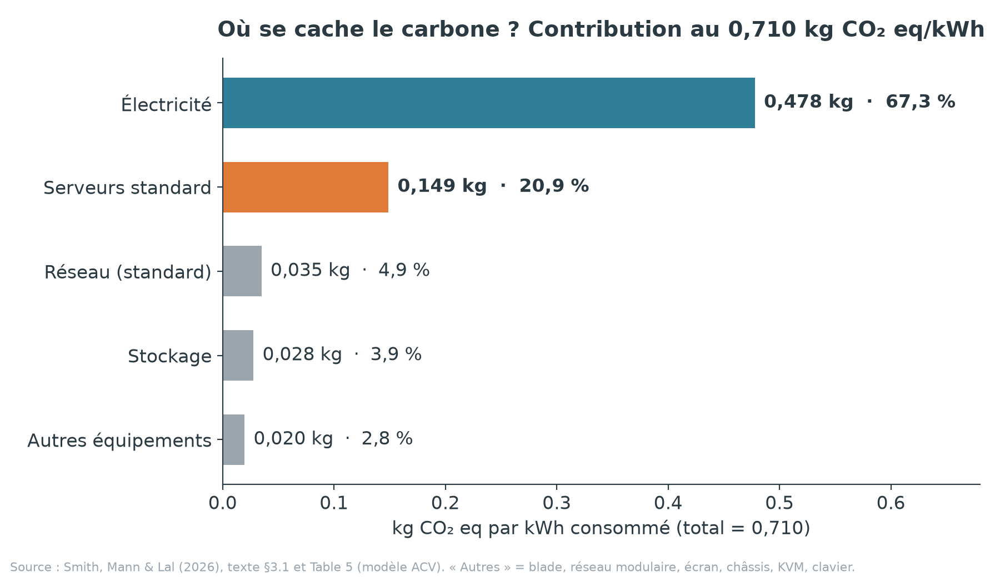
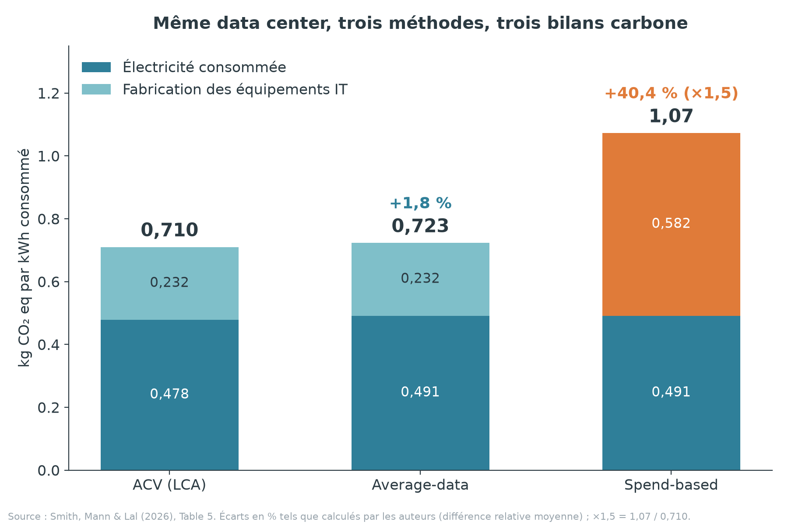
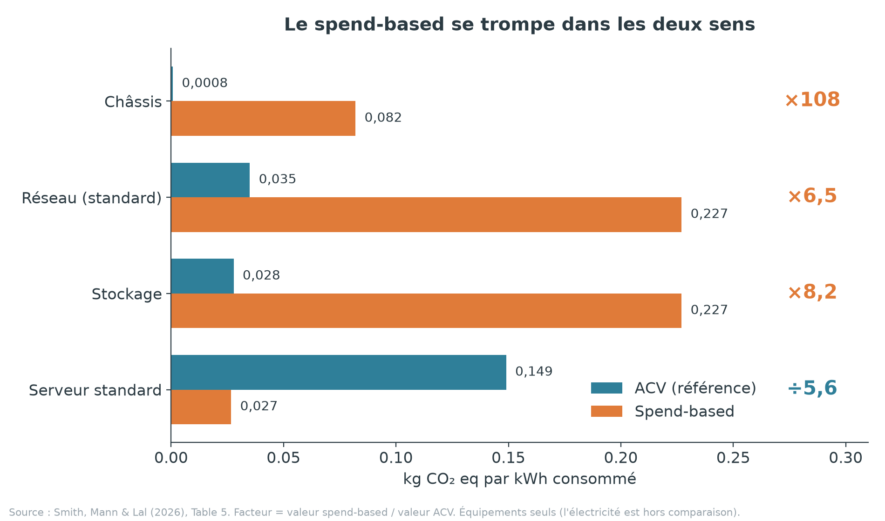

# III. Résultats chiffrés

**Responsable : Emmanuel** · Durée cible de la présentation : 6–7 min
**Article étudié :** Smith, M., Mann, M. & Lal, P. (2026), *Carbon Accounting and Beyond: An Evidence-Based Life Cycle Assessment of the Environmental Impacts of Data Center IT Equipment*, *Sustainability*, 18(11), 5671.

> **Convention de lecture.** Toutes les valeurs sont exprimées **par kWh d'électricité consommé par l'équipement IT** (l'unité fonctionnelle de l'étude), en **kg CO₂ eq**, sauf mention contraire. Les chiffres proviennent de l'article (section 3 « Results », Tables 4 et 5). Le symbole **†** signale une valeur **calculée par nos soins** à partir de ces chiffres ; elle ne figure pas telle quelle dans l'article.

---

## 1. Synthèse de la partie

Cette partie répond à une question simple : **quel est le bilan carbone des équipements IT d'un data center, où se situe-t-il, et dans quelle mesure dépend-il de la méthode de calcul choisie ?**

| Résultat | Valeur | Lecture |
|---|---|---|
| Bilan carbone par ACV | **0,710** kg CO₂ eq/kWh | Valeur de référence de l'étude |
| Part de l'électricité consommée | **67,3 %** (0,478 kg) | Le poste dominant : l'usage pèse plus que la fabrication |
| Part de la fabrication des équipements | **32,7 %** (0,232 kg) † | Émissions « cachées » du Scope 3 |
| Part des serveurs standard | **20,9 %** (0,149 kg) | Premier poste hors électricité |
| Méthode average-data | **0,723** kg CO₂ eq/kWh (**+1,8 %**) | Proche de l'ACV |
| Méthode spend-based | **1,07** kg CO₂ eq/kWh (**+40,4 %**) | Surestimation nette, et mauvaise répartition |
| Robustesse (Monte Carlo) | **CV = 8,08 %** | Très en dessous du seuil de fiabilité de 30 % |
| Impacts hors CO₂ | 2,36 × 10⁻⁶ DALY · 3,37 × 10⁻⁹ espèces·an · 0,047 USD | Invisibles dans un bilan carbone seul |

**Message central :** le bilan carbone des équipements IT est dominé par l'électricité (deux tiers) mais un tiers des émissions provient de la fabrication, très concentré sur les serveurs standard. Le choix de la méthode comptable change le résultat de manière décisive : l'ACV et l'average-data convergent, tandis que le spend-based fournit un chiffre gonflé et une carte des responsabilités erronée.

---

## 2. Cadre de lecture des résultats

Pour interpréter correctement les chiffres, trois éléments de la méthodologie (exposée dans la partie II) sont à garder en tête :

- **Unité fonctionnelle : 1 kWh consommé par l'équipement IT.** Tous les résultats sont donc des intensités carbone, comparables entre méthodes. Il ne s'agit pas d'émissions annuelles totales du site.
- **Deux blocs d'émissions** sont additionnés : l'**électricité consommée** en phase d'usage, et l'**impact de fabrication et de fin de vie des équipements** (extraction des matières premières, fabrication, assemblage, élimination), c'est-à-dire les émissions indirectes de la chaîne d'approvisionnement (Scope 3).
- **Trois méthodes appliquées au même inventaire** : l'ACV (calcul process par process), l'average-data (masse du matériel × facteur d'émission moyen) et le spend-based (prix d'achat × facteur d'émission par dollar). Toutes s'appuient sur les données de procédés ecoinvent, ce qui isole l'effet de la **méthode** de comptabilité et non celui de la source de données.

---

## 3. Le bilan central : 0,710 kg CO₂ eq par kWh

### 3.1 Un résultat, deux moteurs

L'analyse de cycle de vie conclut que **chaque kWh consommé par l'équipement IT est associé à 0,710 kg CO₂ eq** (indicateur « global warming »). Pour donner un ordre de grandeur, cela représente **710 kg de CO₂ eq par MWh** et **710 tonnes par GWh** †.

La contribution se répartit en deux blocs :

| Bloc | kg CO₂ eq / kWh | Part du total |
|---|---|---|
| Électricité consommée (phase d'usage) | 0,478 | **67,3 %** |
| Fabrication et fin de vie des équipements | 0,232 † | **32,7 %** † |
| **Total** | **0,710** | 100 % |

**Interprétation.** L'usage domine : réduire la consommation électrique, ou en décarboner la production, est le levier le plus puissant. Mais un tiers du bilan (0,232 kg par kWh) est **incorporé dans le matériel avant même qu'il ne soit branché**. Cette part est celle que les inventaires carbone classiques mesurent le plus mal, car elle dépend de données que seuls les fournisseurs détiennent. Les auteurs soulignent que ces émissions indirectes ont historiquement été sous-estimées.

### 3.2 La répartition par équipement

*Figure 1 — Contribution de chaque poste au bilan ACV (Table 5 et section 3.1 de l'article).*

| Poste (modèle ACV) | kg CO₂ eq / kWh | Part du total |
|---|---|---|
| Électricité consommée | 0,478 | 67,3 % |
| **Serveurs standard** | **0,149** | **20,9 %** |
| Réseau — standard | 0,0350 | 4,9 % † |
| Stockage | 0,0278 | 3,9 % † |
| Serveurs blade | 0,00921 | 1,3 % † |
| Réseau — modules | 0,00567 | 0,8 % † |
| Écran | 0,00412 | 0,6 % † |
| Châssis | 0,00076 | 0,1 % † |
| Commutateur KVM | 0,0000926 | < 0,1 % † |
| Clavier | 0,00000027 | ≈ 0 % † |
| **Total** | **0,710** | 100 % |

*Les pourcentages marqués † sont calculés en divisant chaque ligne par 0,710 ; la somme peut différer de 100 % de 0,2 point à cause des arrondis.*

**Lecture.** En dehors de l'électricité, **un seul poste ressort nettement : les serveurs standard, à 0,149 kg, soit 20,9 % du total et près des deux tiers (64 %) des émissions liées à la fabrication †**. À lui seul, il pèse plus que le réseau, le stockage et tous les autres équipements réunis (environ 0,08 kg †). Les auteurs l'attribuent principalement au **circuit intégré**, dont la production exige beaucoup d'électricité et d'eau ainsi que des métaux précieux comme l'or.

### 3.3 Le niveau « génération » : le serveur standard de génération 2

Le modèle granulaire distingue trois générations de matériel (G1 : 20 %, G2 : 60 %, G3 : 20 % du parc). Il en ressort qu'**un seul type de machine domine le bilan : le serveur standard de génération 2**, dont la consommation électrique représente **16,7 %** du bilan global et la fabrication **12,6 %**, soit **près de 30 % du total à lui seul** (29,3 % †). Ce résultat s'explique en partie par le poids de G2 dans le parc (60 %), mais il désigne clairement une cible prioritaire : les auteurs en concluent qu'il faut **concentrer les efforts de conception et d'efficacité opérationnelle sur les serveurs**.

Au sein de la seule électricité, le classement (scénario de référence) est le suivant :

| Équipement (génération 2) | Électricité, kg CO₂ eq / kWh |
|---|---|
| Serveur standard | 0,118 |
| Stockage | 0,091 |
| Réseau — standard | 0,046 |

### 3.4 Serveur blade contre serveur standard

Par kWh, un **serveur blade émet 0,00921 kg contre 0,149 kg pour un serveur standard**, soit **93,8 % de moins**, ou environ **16 fois moins** †. Les auteurs recommandent d'explorer la transition vers des serveurs blade plus compacts et plus efficaces, mais précisent que des **comparaisons normalisées par la performance** sont nécessaires : les deux types de serveurs ne fournissent pas exactement le même service ni la même capacité de stockage. Cet écart est donc un signal fort, pas une équivalence.

---

## 4. Comparaison des trois méthodes de comptabilité carbone

### 4.1 Résultats d'ensemble

*Figure 2 — Bilan carbone du même data center selon les trois méthodes (Table 5). Les valeurs d'électricité et d'équipements sont décomposées à partir des lignes de la Table 5.*

| kg CO₂ eq / kWh | ACV | Average-data | Spend-based |
|---|---|---|---|
| Électricité consommée | 0,478 | 0,491 | 0,491 |
| Équipements IT (somme des lignes) | 0,232 † | 0,232 † | 0,582 † |
| **Total** | **0,710** | **0,723** | **1,07** |
| Écart par rapport à l'ACV | référence | **+1,81 %** | **+40,4 %** |
| Écart par rapport à l'average-data | | référence | +38,7 % |

**Comment lire les écarts.** Les auteurs calculent les pourcentages comme une **différence relative moyenne** : écart divisé par la moyenne des deux valeurs comparées. Ainsi (1,07 − 0,710) / 0,890 = 40,4 %. En rapport simple, le spend-based donne **1,5 fois** le résultat de l'ACV (1,07 / 0,710), soit **+51 %** †. Les deux lectures sont exactes ; le rapport ×1,5 est simplement plus intuitif. Pour un site consommant 1 GWh, le spend-based déclarerait ainsi environ **1 070 tonnes au lieu de 710, soit 360 tonnes de CO₂ supplémentaires** †.

### 4.2 L'average-data : un résultat proche, à condition que le facteur soit fiable

L'average-data aboutit à **0,723 kg CO₂ eq/kWh**, soit seulement 1,8 % de plus que l'ACV. La décomposition montre que **les équipements sont pratiquement identiques** dans les deux méthodes (0,232 dans les deux cas, ligne par ligne dans la Table 5). L'écart provient uniquement de l'**électricité** (0,491 contre 0,478) : l'average-data ne tient pas compte des **différences d'efficacité entre générations d'équipements** que le modèle ACV représente.

Les auteurs en concluent que, **lorsque le facteur d'émission sous-jacent est fiable, l'average-data fournit un résultat raisonnable**, même si elle ne rend pas compte des écarts d'efficacité entre générations. Il faut toutefois nuancer : les deux méthodes s'appuient sur le **même inventaire ecoinvent**, leur proximité ne constitue donc pas une validation par des sources indépendantes.

### 4.3 Le spend-based : un chiffre gonflé et une mauvaise carte des responsabilités

Le spend-based multiplie le **prix d'achat** de chaque équipement par un facteur d'émission par dollar. Il donne **1,07 kg CO₂ eq/kWh**. Presque toute la différence se situe sur les équipements : **0,582 kg contre 0,232 pour l'ACV, soit 2,5 fois plus †**, alors que la part d'électricité reste comparable (0,491).

*Figure 3 — Écart ligne par ligne entre spend-based et ACV (Table 5). Le facteur indique la valeur spend-based divisée par la valeur ACV.*

| Équipement | ACV | Spend-based | Facteur † |
|---|---|---|---|
| Châssis | 0,00076 | 0,082 | **× 108** |
| Stockage | 0,0278 | 0,227 | **× 8,2** |
| Réseau — standard | 0,0350 | 0,227 | **× 6,5** |
| Serveur standard | 0,149 | 0,0267 | **÷ 5,6** |
| Serveur blade | 0,00921 | 0,00236 | ÷ 3,9 |
| Écran | 0,00412 | 0,000464 | ÷ 8,9 |

**Un double biais.** Le spend-based ne fait pas que surestimer le total : il **déforme la hiérarchie des postes**. Il attribue plus de 100 fois trop d'émissions au châssis et 6 à 8 fois trop au réseau et au stockage, mais il **sous-estime le serveur standard d'un facteur 5,6**, pourtant le véritable point chaud identifié par l'ACV. Un gestionnaire qui piloterait sa réduction d'émissions avec cette méthode agirait donc sur les mauvais équipements.

**Pourquoi ce biais ?** Les auteurs avancent deux raisons :
1. **Le facteur d'émission est associé à la composition matérielle d'un type d'équipement, non à l'équipement lui-même.** La méthode s'appuie sur les facteurs de l'EPA américaine par secteur (base « Supply Chain GHG Emission Factors v1.3 », en kg CO₂ eq par dollar, 1 016 catégories NAICS), nettement moins détaillés que ecoinvent.
2. **Le prix ne reflète pas la seule matière** : il inclut les frais généraux, la main-d'œuvre, le transport, la marge du fournisseur et les fluctuations du marché.

**Conséquence pratique retenue par les auteurs :** **éviter le spend-based pour les décisions à enjeu** (tarification carbone, empreinte produit), sauf en l'absence de toute autre donnée.

---

## 5. Robustesse des résultats

### 5.1 Analyse de sensibilité (taux d'utilisation)

Les auteurs ont fait varier le **taux d'utilisation** des serveurs entre un scénario bas et un scénario haut, par génération d'équipement (Table 4) :

| Scénario | Utilisation (G1 · G2 · G3) | Électricité, kg CO₂ eq / kWh | Part de l'électricité dans le bilan |
|---|---|---|---|
| Bas | 38 % · 48 % · 58 % | 0,382 | 62,2 % |
| **Référence** | 48 % · 60 % · 72 % | **0,478** | **67,3 %** |
| Haut | 58 % · 72 % · 86 % | 0,573 | 71,2 % |

**Constats.** La consommation électrique évolue d'environ 25 % d'un scénario à l'autre, de façon **linéaire et prévisible**, sans effet disproportionné. Surtout, **l'électricité reste dominante dans tous les cas (62,2 % à 71,2 %)** et le **classement des contributeurs ne change pas** : le serveur standard de génération 2 reste en tête, suivi du stockage et du réseau standard. Le modèle est donc structurellement stable, et ses conclusions sur les contributeurs principaux ne dépendent pas d'hypothèses d'utilisation précises. Les équipements périphériques contribuent de façon négligeable : les efforts doivent viser les **systèmes centraux** (serveurs, stockage, réseau).

### 5.2 Simulation de Monte Carlo (incertitude)

Une simulation de **1 000 itérations** a été menée sur le modèle granulaire. Le critère retenu est le **coefficient de variation (CV)**, mesure de la dispersion relative : **un CV inférieur à 30 % est considéré comme fiable**.

- Pour le **réchauffement climatique**, le CV est de **8,08 %**, très largement sous le seuil. Le chiffre de **0,710 kg CO₂ eq/kWh est donc statistiquement stable**.
- La majorité des catégories d'impact respectent également ce seuil.
- Les indicateurs **finaux de santé humaine et de qualité des écosystèmes** présentent des CV nettement plus élevés, car ils agrègent plusieurs indicateurs intermédiaires soumis à une forte variabilité spatiale et temporelle. Les auteurs recommandent donc de les interpréter avec prudence, et de privilégier les indicateurs intermédiaires plus robustes.

---

## 6. Au-delà du CO₂ : les impacts qu'un bilan carbone ne voit pas

Un intérêt majeur de l'ACV (méthode ReCiPe 2016) est de mesurer d'autres impacts que le climat. Le carbone est l'indicateur que les entreprises doivent déclarer, mais il ne résume pas l'empreinte environnementale.

### 6.1 Impacts finaux (« endpoint ») par kWh

| Indicateur | Valeur par kWh | Part de l'électricité | Part du serveur standard |
|---|---|---|---|
| **Santé humaine** (années de vie perdues ou vécues en incapacité, DALY) | 2,36 × 10⁻⁶ | 51 % | 31 % |
| **Écosystèmes** (perte locale relative d'espèces, espèces·an) | 3,37 × 10⁻⁹ | 57 % | 27 % |
| **Rareté des ressources** (surcoût futur d'extraction, USD 2013) | 0,04663 (≈ 0,047) | 70 % | 19 % |

Pour donner un ordre de grandeur, 1 GWh consommé correspond à environ **2,4 années de vie en bonne santé perdues †** (2,36 × 10⁻⁶ × 1 000 000). L'électricité reste le premier contributeur des trois indicateurs, et le **serveur standard y pèse de façon notable**, entre 19 % et 31 %.

### 6.2 Le serveur standard, point chaud de la toxicité et des ressources

Sur plusieurs indicateurs intermédiaires, **le serveur standard devient le premier contributeur, devant l'électricité** :

| Indicateur | Valeur par kWh |
|---|---|
| Écotoxicité de l'eau douce | 0,0974 kg 1,4-DCB |
| Écotoxicité marine | 0,128 kg 1,4-DCB |
| Toxicité humaine non cancérogène | 1,53 kg 1,4-DCB |
| Rareté des ressources minérales | 0,00497 kg Cu eq |
| Consommation d'eau | 0,00438 m³ |

Ces impacts sont attribués pour **75 à 98 %** au **circuit intégré**, et la consommation d'eau à **79 %** au **silicium de qualité électronique**.

### 6.3 Enseignement pour la décision

Ces résultats montrent qu'**un même levier n'a pas les mêmes effets selon l'objectif visé**. Si le CO₂ est la seule priorité, le gestionnaire ciblera l'efficacité électrique. S'il s'intéresse aussi aux impacts de fabrication (toxicité, eau, ressources), d'autres options apparaissent, comme **reconditionner d'anciennes générations de matériel plutôt qu'en acheter de nouvelles**. Le modèle granulaire permet de simuler ces arbitrages, y compris de déterminer **à quel moment remplacer un équipement avant la fin de sa durée de vie théorique** pour gagner en efficacité.

---

## 7. Ce qu'il faut retenir

1. **0,710 kg CO₂ eq par kWh** est le bilan ACV de référence, fiable (CV de 8,08 %) et stable face aux variations d'utilisation.
2. **L'électricité pèse 67,3 %** du bilan ; les **32,7 % restants** sont des émissions incorporées dans le matériel, que les inventaires classiques captent mal.
3. **Les serveurs standard concentrent 20,9 % du bilan**, et le serveur standard de génération 2 en représente près de 30 % à lui seul : c'est la cible prioritaire.
4. **L'average-data (+1,8 %) est acceptable, le spend-based (+40,4 %) ne l'est pas** : il gonfle le total d'un facteur 1,5 et inverse la hiérarchie des postes (× 108 sur le châssis, ÷ 5,6 sur le serveur standard).
5. **Le CO₂ ne suffit pas** : santé humaine, écosystèmes, eau, toxicité et ressources dépendent fortement des serveurs et de l'électricité, et échappent à un bilan carbone seul.

### Portée et limites de ces résultats

Les valeurs absolues sont propres à **un seul data center américain** (réseau électrique des États-Unis, PUE de 1,88, périmètre limité à l'équipement IT et à son électricité). En revanche, **l'enseignement méthodologique** (écart entre méthodes, hiérarchie des postes) est généralisable. Les Tables S6 à S9 citées dans l'article sont dans le matériel supplémentaire, qui n'est pas inclus dans le PDF du dépôt.

---

## 8. Transition vers la partie IV

Le carbone est maintenant localisé : deux tiers dans l'électricité consommée, un cinquième dans les serveurs standard. La question suivante est **opérationnelle : comment le réduire, et à quel prix pour les autres impacts ?** Les deux scénarios testés par les auteurs (panneaux solaires en toiture, réseau électrique bas-carbone) y répondent dans la partie IV–V.

---

## Annexe — Visuels et sources

| Visuel | Fichier | Source |
|---|---|---|
| Figure 1 : répartition du bilan | `graphiques/03_resultats_fig2_repartition_carbone.png` | Section 3.1 et Table 5 |
| Figure 2 : trois méthodes | `graphiques/03_resultats_fig1_comparaison_methodes.png` | Table 5 |
| Figure 3 : spend-based contre ACV | `graphiques/03_resultats_fig3_spend_based_vs_acv.png` | Table 5 |

**Sources dans l'article :** résultats midpoint et endpoint (section 3.1) ; analyse de sensibilité, Table 4 (section 3.2) ; simulation de Monte Carlo (section 3.3) ; comparaison des méthodes, Table 5 (section 3.5) ; conclusions (section 4).

**Point d'attention.** Dans sa conclusion, l'article écrit que les serveurs standard représentent « 20,9 % de ces émissions indirectes ». Cette phrase est ambiguë : d'après la section 3.1 et la Table 5, **20,9 % est la part du bilan total** (0,149 / 0,710), ce qui représente environ 64 % des seules émissions indirectes. Nous retenons la lecture « part du total ».
