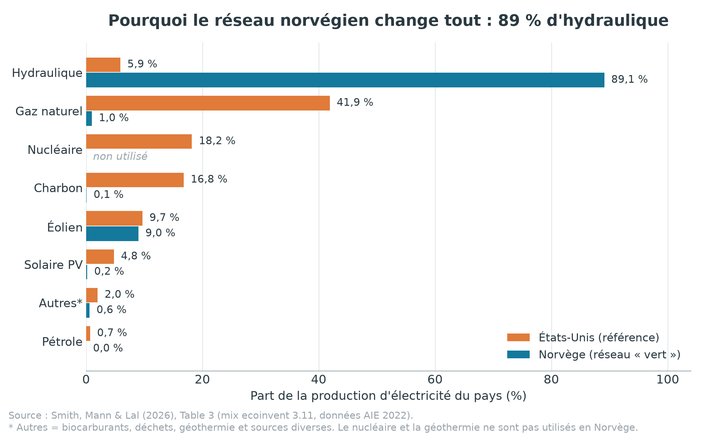
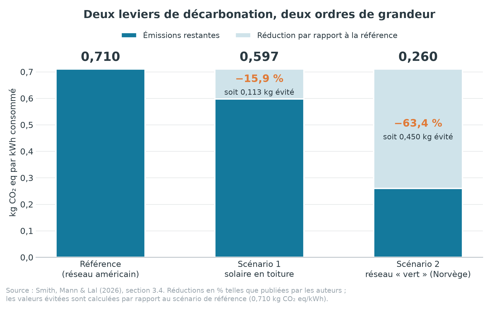
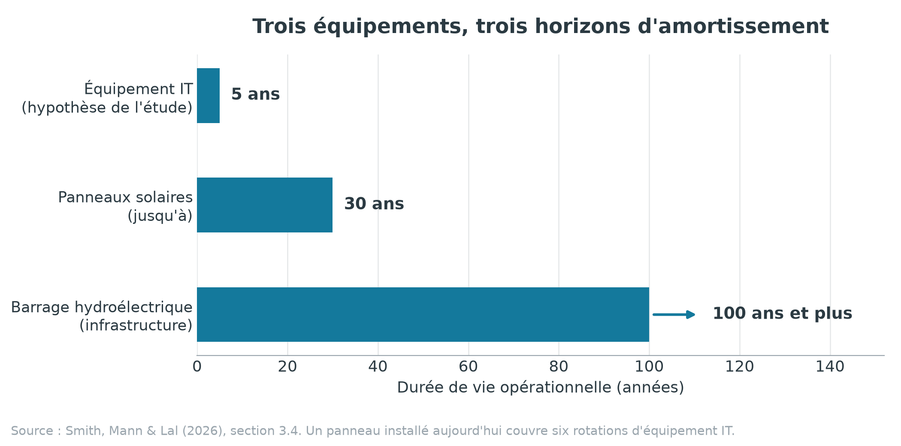

# IV–V. Scénarios & recommandations

**Responsable : Lilian** · Durée cible de la présentation : 6–7 min
**Article étudié :** Smith, M., Mann, M. & Lal, P. (2026), *Carbon Accounting and Beyond: An Evidence-Based Life Cycle Assessment of the Environmental Impacts of Data Center IT Equipment*, *Sustainability*, 18(11), 5671.

> **Convention de lecture.** Comme dans la partie III, toutes les valeurs sont exprimées **par kWh d'électricité consommé par l'équipement IT** (l'unité fonctionnelle de l'étude), en **kg CO₂ eq**, sauf mention contraire. Les chiffres proviennent de l'article (sections 2.5, 3.4, 4 et 5, et Table 3). Le symbole **†** signale une valeur **calculée par nos soins** à partir de ces chiffres ; elle ne figure pas telle quelle dans l'article.

---

## 1. Synthèse de la partie

Les parties précédentes ont établi *où* se trouve le carbone. Celle-ci répond à la question opérationnelle : **que peut-on réellement faire pour le réduire, à quel prix pour les autres impacts, et qu'est-ce que tout cela implique pour la manière dont une entreprise compte son carbone ?**

| Résultat | Valeur | Lecture |
|---|---|---|
| Scénario de référence | **0,710** kg CO₂ eq/kWh | Réseau électrique américain |
| Scénario 1 — solaire en toiture | **0,597** kg CO₂ eq/kWh (**−15,9 %**) | ≈ 220 systèmes PV, 10 % de l'électricité déplacée |
| Scénario 2 — réseau « vert » | **0,260** kg CO₂ eq/kWh (**−63,4 %**) | Mix norvégien, 89,1 % d'hydraulique |
| Rapport d'efficacité entre les deux leviers | **× 4** † | 0,450 contre 0,113 kg évité par kWh † |
| Projection du solaire sur 5 ans | **7 645 tonnes** de CO₂ eq évitées | ≈ carbone séquestré par 7 668 acres de forêt en un an (EPA) |
| Contrepartie du solaire | 6 catégories d'impact **dégradées** | Toxicités, écotoxicités, particules fines, eutrophisation |
| Contrepartie du réseau « vert » | **Consommation d'eau** la plus élevée | L'hydraulique norvégienne |
| Durées de vie comparées | 5 ans (IT) · 30 ans (PV) · 100 ans et + (hydro) | Horizons d'amortissement sans commune mesure |

**Message central :** décarboner l'électricité est de loin le levier le plus puissant — mais aucun des deux scénarios ne déplace le point chaud identifié par l'ACV, le **serveur standard**. Et les deux ont un coût environnemental ailleurs que sur le CO₂. C'est précisément l'argument de l'étude : seule une méthode qui regarde **tout le cycle de vie et pas seulement le carbone** permet de voir ces arbitrages — et donc de décider correctement.

---

## 2. Comment les deux scénarios ont été construits

Les auteurs partent d'un constat de la littérature : dans les études existantes, **l'électricité représente 60 à 98 % de l'impact environnemental d'un data center**. C'est donc sur le mix électrique qu'ils testent deux leviers — un **sur site** (produire soi-même), un **hors site** (changer de réseau).

### 2.1 Scénario 1 — le solaire en toiture (production sur site)

Le bâtiment est exclu du périmètre de l'ACV, mais **ses dimensions sont réutilisées pour le scénario**. Le dimensionnement est entièrement explicite dans l'article :

| Étape du calcul | Valeur |
|---|---|
| Bâtiment | 2 étages, ≈ 6 700 m² de surface technique (*raised space*) |
| Surface de toiture disponible | ≈ 3 300 m² |
| Système retenu | Panneaux photovoltaïques multicristallins (multi-Si) de 3 kW |
| Emprise d'un système | 13–18 m² (moyenne retenue : 15 m²), soit 8 à 10 panneaux de 300–400 Wc |
| Nombre de systèmes installables | ≈ **220** |
| Puissance installée totale | **660 kW** |
| Hypothèse d'ensoleillement | 5 heures de plein soleil par jour |
| Production estimée | ≈ **6 GWh sur 5 ans** |
| Consommation des équipements IT sur leur durée de vie | **63,9 GWh** |
| Part de l'électricité réseau déplacée | ≈ **10 %** (6 / 63,9 = 9,4 % †) |

L'hypothèse forte, assumée par les auteurs : **toute l'électricité solaire produite est autoconsommée** par l'entreprise. C'est ce qui permet de la déduire directement de la consommation réseau.

### 2.2 Scénario 2 — le réseau « vert » (production hors site)

Ici, aucun équipement n'est ajouté : on change simplement le **pays** dont le mix électrique alimente le data center. Les auteurs justifient ce choix par un argument concret : contrairement aux autres énergies, **l'électricité s'échange peu entre pays**, donc un mix national est une unité de comparaison pertinente.

Le modèle de référence utilise le mix **américain** ; le scénario de comparaison retient la **Norvège**, choisie comme exemple illustratif d'un réseau très largement renouvelable (données ecoinvent 3.11, mix AIE 2022).

*Figure 1 — Mix de production électrique des deux pays (Table 3 de l'article).*

| Source | États-Unis | Norvège |
|---|---|---|
| Gaz naturel | 41,9 % | 1,0 % |
| Nucléaire | 18,2 % | non utilisé |
| Charbon | 16,8 % | 0,1 % |
| Éolien | 9,7 % | 9,0 % |
| **Hydraulique** | **5,9 %** | **89,1 %** |
| Solaire PV | 4,8 % | 0,2 % |
| Pétrole | 0,7 % | 0,0 % |
| Autres (biocarburants, déchets, géothermie, divers) | 2,0 % † | 0,6 % † |

**Lecture.** Le réseau américain est à **59,4 % fossile** (gaz + charbon + pétrole) † ; le réseau norvégien à **1,1 %** †. C'est tout l'écart du scénario 2, et il ne coûte au data center aucun investissement matériel — seulement une décision d'implantation.

---

## 3. Résultats : deux leviers, deux ordres de grandeur

*Figure 2 — Bilan carbone par kWh dans les trois scénarios (section 3.4 de l'article).*

| Scénario | kg CO₂ eq/kWh | Réduction | Évité par kWh |
|---|---|---|---|
| Référence (réseau américain) | 0,710 | — | — |
| **Scénario 1 — solaire en toiture** | **0,597** | **−15,9 %** | 0,113 † |
| **Scénario 2 — réseau « vert »** | **0,260** | **−63,4 %** | 0,450 † |

### 3.1 Le solaire : un rendement carbone meilleur que prévu

Le point le plus intéressant du scénario 1 est une **disproportion** : déplacer **10 %** de l'électricité réseau produit **15,9 %** de réduction d'émissions — soit environ **1,6 fois plus d'effet que la part déplacée** †. Les auteurs donnent deux explications :

1. **L'électricité déplacée est plus carbonée que la moyenne du système.** On ne retire pas 10 % d'un bilan homogène : on retire les kWh les plus émetteurs, alors que le solaire a une intensité carbone de cycle de vie très inférieure.
2. **L'électricité réseau traîne des émissions amont** — extraction, traitement et combustion du combustible — qui sont **quasi absentes du photovoltaïque**. Les impacts du solaire sont concentrés dans la **fabrication**, et amortis sur une durée d'exploitation longue.

C'est un point à retenir pour la présentation : **une action partielle sur le mix électrique rend plus que proportionnellement**, parce que le carbone n'est pas réparti uniformément dans les kWh consommés.

### 3.2 Le réseau « vert » : le levier le plus efficace, et de loin

Le scénario 2 fait passer le bilan à **0,260 kg CO₂ eq/kWh, soit −63,4 %**. Par kWh, il évite **0,450 kg contre 0,113 pour le solaire : quatre fois plus** †. Les auteurs en tirent une conclusion sans ambiguïté — c'est la phrase qui ressort du résumé de l'article : **la décarbonation du réseau est la stratégie d'atténuation la plus efficace.**

Deux nuances à porter à l'oral :

- Ce levier n'est **pas un choix d'ingénierie mais un choix d'implantation** (ou d'approvisionnement électrique). Il est hors de portée d'un exploitant qui ne peut pas déplacer son site — mais il est décisif pour toute décision de **nouvelle localisation**.
- Il ne supprime pas tout. Sur les 0,260 kg restants, **l'essentiel n'est plus de l'électricité mais de la fabrication** : en gardant la part « équipements » à 0,232 kg (inchangée d'un scénario à l'autre, puisque seule la source d'électricité change), il resterait environ **0,028 kg d'électricité, soit ~89 % du bilan résiduel imputable au seul matériel** †. Autrement dit : **plus le réseau se décarbone, plus le carbone incorporé dans les serveurs devient le sujet principal.** *(Estimation de notre part ; la décomposition officielle figure en Table S9, non incluse dans le PDF du dépôt.)*

### 3.3 Ce que ça donne à l'échelle du site, sur 5 ans

Pour rendre les chiffres tangibles, les auteurs projettent le scénario solaire sur la durée de vie du parc :

> **7 645 tonnes de CO₂ eq évitées sur 5 ans**, soit l'équivalent du carbone séquestré par **7 668 acres de forêt en un an** (≈ **3 100 hectares** †), selon le calculateur d'équivalences de l'EPA américaine.

C'est le chiffre à afficher en grand : il traduit une intensité carbone abstraite (kg/kWh) en un ordre de grandeur physique.

---

## 4. Le trade-off : ce que chaque solution « verte » coûte ailleurs

C'est ici que l'ACV apporte ce qu'aucune comptabilité carbone ne peut donner. En regardant les **18 catégories d'impact** de la méthode ReCiPe et pas seulement le climat, le classement des scénarios **s'inverse** sur plusieurs d'entre elles.

| Catégorie d'impact | Scénario le plus pénalisé | Pourquoi |
|---|---|---|
| Réchauffement climatique (et la majorité des catégories) | **Référence** | Le mix fossile américain |
| Particules fines, eutrophisation des eaux douces, écotoxicité terrestre, écotoxicité des eaux douces, écotoxicité marine, toxicité humaine non cancérogène | **Solaire en toiture** | L'ajout physique des panneaux multi-Si au périmètre — en particulier les **cellules de plaquettes (wafers) multi-Si** |
| Consommation d'eau | **Réseau « vert »** | La Norvège produit son électricité à 89 % en **hydraulique** |

*Lecture qualitative : l'article indique quel scénario est le plus pénalisé par catégorie sans publier les valeurs dans le corps du texte (elles sont en Table S9, matériel supplémentaire non inclus dans le PDF du dépôt).*

Quatre conséquences à énoncer clairement :

**1. Le solaire n'est pas gratuit environnementalement.** Les auteurs l'écrivent sans détour : les impacts hors carbone du photovoltaïque **peuvent l'emporter sur le bénéfice CO₂**, ce qui impose une évaluation équilibrée plutôt qu'un raisonnement carbone seul. Et lorsqu'on normalise les résultats, **ce sont justement les catégories de toxicité qui remontent en tête des priorités**, parce qu'elles touchent directement la santé humaine et les écosystèmes.

**2. Ces bénéfices s'apprécient sur des horizons de temps différents.** L'équipement IT est modélisé sur **5 ans**, un panneau solaire dure **jusqu'à 30 ans**, une infrastructure hydroélectrique **plus de 100 ans**. Un panneau installé aujourd'hui couvre donc **six rotations complètes de matériel informatique** † : son impact de fabrication s'amortit sur une durée que le matériel IT n'atteint jamais.

*Figure 3 — Durées de vie opérationnelles comparées (section 3.4 de l'article).*

**3. Aucun des deux scénarios ne règle le problème du serveur standard.** C'est le constat le plus important de la partie, et il fait le lien direct avec les résultats d'Emmanuel : *« l'ajout de panneaux solaires ou l'exploitation sur un réseau vert ne déplace pas le poids de l'impact environnemental des serveurs standard »*. Le serveur standard doit donc être traité **en priorité** — indépendamment de toute stratégie énergétique.

**4. Il existe aussi un coût économique et un coût matière.** Les auteurs mentionnent que le **coût d'installation et de maintenance** du solaire peut être prohibitif au regard du bénéfice carbone. Et plus largement, la transition renouvelable est **intensive en ressources** : métaux, terres rares, béton, donc extraction minière et fabrication à grande échelle, avec des risques de conséquences environnementales non voulues et de tensions sur les chaînes d'approvisionnement.

---

## 5. Recommandations

Les recommandations de l'article se lisent à trois niveaux. À l'oral, c'est la partie « donc, concrètement, on fait quoi ? ».

### 5.1 Sur la méthode de comptabilité carbone

| Recommandation | Justification dans l'article |
|---|---|
| **Éviter le spend-based pour toute décision à enjeu** — tarification carbone, empreinte produit — sauf en l'absence totale d'autre donnée | Surestimation de 40,4 % et hiérarchie des postes inversée (partie III) |
| **L'average-data reste acceptable** comme méthode de premier niveau, **à condition que le facteur d'émission sous-jacent soit fiable** | Écart de seulement 1,81 % avec l'ACV, malgré l'absence de distinction entre générations d'équipement |
| **Adopter une approche hybride ou à paliers** : comptabilité GHG de screening + ACV ciblée sur les décisions et secteurs à fort impact | L'ACV est plus juste mais exige plus de données, d'expertise et de moyens de calcul — le compromis doit être assumé, pas subi |
| **Collaborer avec les fournisseurs** pour obtenir des facteurs d'émission au niveau du produit | Le manque de données *cradle-to-gate* spécifiques par type — idéalement par produit — est décrit comme le **verrou central de l'industrie** |
| **Former les équipes** — durabilité, achats, direction — aux arbitrages méthodologiques | Sans littératie méthodologique, les chiffres sont mal interprétés et les décisions d'abattement ratent leur cible |

### 5.2 Sur l'exploitation du data center

- **Prioriser les serveurs standard.** Ils concentrent le carbone hors électricité *et* les impacts de toxicité et de ressources minérales, et aucun scénario énergétique ne les fait disparaître.
- **Viser le mix électrique en premier lieu** pour le carbone : c'est le levier à −63,4 %. Pour un site existant, cela passe par l'approvisionnement ; pour un nouveau site, par la localisation.
- **Traiter le solaire sur site comme un complément**, avec un rendement carbone meilleur que sa part de production (−15,9 % pour 10 % déplacés), mais en intégrant ses impacts de fabrication dans la décision.
- **Exploiter la granularité du modèle ACV** pour arbitrer des décisions de parc : reconditionner plutôt que renouveler, ou déterminer le moment optimal de remplacement d'un équipement avant la fin de sa durée de vie théorique.
- **Ne pas ignorer le cycle de vie complet des solutions « vertes »** : les auteurs appellent explicitement à poursuivre les travaux sur le **recyclage**, les **pratiques minières durables** et les **nouveaux matériaux et procédés de fabrication**, pour que la transition vers un réseau vert ne crée pas de dommages ailleurs.

### 5.3 Sur les politiques publiques

- **Standardiser les méthodes de comptabilité** : leur absence d'harmonisation produit des reportings incohérents, peu comparables, et ouvre la porte à la déclaration sélective. C'est un problème direct pour les régulateurs, les investisseurs et tout acteur qui veut comparer des performances ou fixer des objectifs.
- **Inciter à un reporting informé par l'ACV** dans les secteurs très consommateurs d'énergie, pour aligner les émissions déclarées sur les impacts réels.
- **Prévoir des standards à paliers**, qui reconnaissent le compromis entre simplicité comptable et justesse scientifique.

---

## 6. Limites de l'étude

À énoncer honnêtement — cela renforce la crédibilité du rendu plutôt que l'inverse.

1. **Un seul site, aux États-Unis.** Les données primaires viennent d'un data center *enterprise* américain : les valeurs absolues ne sont pas généralisables telles quelles. Les auteurs appellent à répliquer le cadre sur d'autres réalités opérationnelles et géographiques, notamment avec l'essor du cloud et de l'IA.
2. **Un périmètre volontairement restreint.** Seuls l'équipement IT actif et son électricité sont modélisés. Le *gray space* (onduleurs, groupes électrogènes, climatisation) et le bâtiment lui-même — structure, électricité, second œuvre, enveloppe — restent à étudier, en distinguant construction neuve et rénovation.
3. **Un inventaire partagé par les trois méthodes.** ACV, average-data et spend-based reposent toutes sur ecoinvent 3.11 : la comparaison mesure un **écart de méthode**, pas des estimations issues de sources indépendantes. Les auteurs recommandent de rejouer l'étude avec des facteurs d'émission externes à ecoinvent.
4. **Des impacts encore mal connus.** Au-delà du CO₂ — autres gaz à effet de serre, épuisement des ressources, pollutions localisées — le spectre environnemental des data centers reste peu documenté, faute de données produit accessibles au niveau des fournisseurs.
5. **Pour nos scénarios en particulier :** le dimensionnement solaire repose sur des hypothèses moyennes (15 m² par système, 5 heures de plein soleil, 100 % d'autoconsommation), et la Norvège est explicitement présentée comme un **exemple illustratif**, pas comme une cible réaliste pour tout opérateur.

---

## 7. Ce qu'il faut retenir

1. **Décarboner le réseau est le levier le plus puissant : −63,4 %** (0,710 → 0,260 kg CO₂ eq/kWh), soit **quatre fois l'effet du solaire en toiture** †.
2. **Le solaire rend plus que sa part** : 10 % d'électricité déplacée produit 15,9 % de réduction, parce que les kWh évités sont les plus carbonés et que le PV n'a quasiment pas d'émissions amont.
3. **Aucune stratégie énergétique ne règle le problème du serveur standard** — il reste le point chaud du carbone incorporé, de la toxicité et des ressources minérales. Plus le réseau se décarbone, plus il devient dominant.
4. **Chaque solution verte a un coût ailleurs** : le solaire dégrade six catégories d'impact (toxicités, particules, eutrophisation) via les wafers multi-Si ; le réseau norvégien est le plus consommateur d'eau. Un bilan carbone seul ne voit rien de tout cela.
5. **D'où la recommandation centrale de l'article** : abandonner le spend-based pour les décisions à enjeu, adopter une approche hybride GHG + ACV ciblée, et obtenir des données produit auprès des fournisseurs.

---

## 8. Conclusion de la présentation

En quatre parties, nous sommes passés d'un constat à une méthode, puis d'une méthode à des décisions.

Mohamed a montré que le secteur croît vite et se mesure mal, avec un Scope 3 largement hors de contrôle. Merouan a montré comment on peut le mesurer autrement, avec un modèle ACV construit sur un inventaire réel. Emmanuel a montré ce que cette mesure révèle : **0,710 kg CO₂ eq par kWh**, dominé aux deux tiers par l'électricité, avec un tiers incorporé dans le matériel et un point chaud unique — le serveur standard. Et le spend-based, la méthode la plus utilisée par défaut, gonfle le total de 40 % **et** désigne les mauvais équipements.

Cette dernière partie ferme la boucle. Les deux scénarios testés montrent que le levier le plus efficace est aussi le plus simple à énoncer — **changer la source d'électricité** — et que le second levier, le solaire, rend plus que prévu mais déplace une partie du problème vers la toxicité et les ressources. Surtout, aucun des deux ne dispense de traiter le matériel lui-même.

**La conclusion à retenir tient en une phrase : on ne pilote bien que ce qu'on mesure bien.** Une entreprise qui compte son carbone au prix d'achat de ses serveurs ne saura ni combien elle émet, ni où agir. L'ACV coûte plus cher en données et en expertise — mais c'est la seule méthode qui, dans cette étude, désigne correctement la cible et montre les arbitrages avant qu'ils ne soient subis.

---

## Version diapositives

Une version mise en page de cette partie (mêmes contenus, même identité visuelle que les parties I et III) est disponible dans [`04_scenarios_recommandations_lilian.html`](./04_scenarios_recommandations_lilian.html) — 10 diapositives, navigation aux flèches, images intégrées au fichier.

---

## Annexe — Visuels et sources

| Visuel | Fichier | Source dans l'article |
|---|---|---|
| Figure 1 : mix électrique comparé | `graphiques/04_scenarios_fig2_mix_electrique.png` | Table 3 (section 2.5) |
| Figure 2 : réduction par scénario | `graphiques/04_scenarios_fig1_reduction_co2.png` | Section 3.4 |
| Figure 3 : durées de vie comparées | `graphiques/04_scenarios_fig3_horizons_temporels.png` | Section 3.4 |

**Sources dans l'article :** construction des scénarios, section 2.5 et Table 3 ; résultats des scénarios, section 3.4 et Figure 4 ; recommandations méthodologiques et implications politiques, section 4 (Conclusions) ; limites, section 5. Les résultats détaillés par catégorie d'impact figurent en **Table S9** du matériel supplémentaire, qui n'est pas inclus dans le PDF du dépôt.

### Points d'attention (relevés à la lecture)

1. **Formulation ambiguë en section 3.4.** L'article écrit que « le scénario de référence *performs the lowest* » dans la plupart des catégories, puis cite des exceptions où c'est le scénario solaire. Prise littéralement, la formule pourrait se lire « obtient l'impact le plus faible » — mais cette lecture contredirait à la fois le résultat sur le réchauffement climatique (la référence y est la plus émettrice) et l'explication donnée juste après (*« due to the physical addition of multi-Si PV solar panels »*, qui ne peut qu'**augmenter** un impact). Nous retenons donc la lecture « **est le plus mal classé** », seule cohérente avec le reste du texte. C'est celle utilisée dans le tableau de la section 4.
2. **Unité de la projection sur 5 ans.** L'article écrit « 7645 metric tons kg CO₂ eq » — les deux unités sont accolées. Nous retenons **7 645 tonnes**, cohérent avec l'équivalence forêt citée dans la même phrase. À noter : en recalculant naïvement (0,113 kg/kWh × 63,9 GWh), on obtient ≈ 7 220 tonnes †, soit 6 % d'écart avec la valeur publiée ; les auteurs ont vraisemblablement utilisé des valeurs non arrondies ou un périmètre de consommation légèrement différent. L'ordre de grandeur est confirmé, et cela ne change rien au message.
3. **Décomposition des scénarios.** La répartition électricité / équipements **à l'intérieur** de chaque scénario n'est pas publiée dans le corps de l'article (Table S9). L'estimation des ~89 % de bilan résiduel imputables au matériel dans le scénario « réseau vert » (section 3.2) est **de notre fait** et repose sur l'hypothèse d'une fabrication inchangée entre scénarios.
